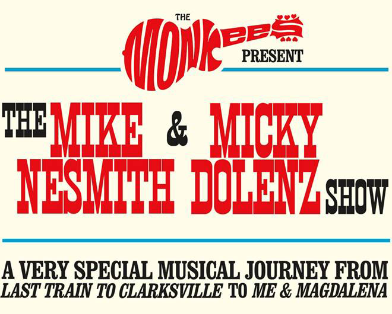

# User Centric Frontend Development Milestone Project - Hey Hey We're the Monkees

In this project I have created a new website for the band "The Monkees". The website is a one stop shop for all things Monkees. Fans
can come and listen to their favourite tracks, watch videos and find links to the various social media platforms that their favourite
Monkees use. Additionally new fans can come and find out information about the Monkees or find links to purchase cool Monkees merch to show the world how much they love the Monkees. 

In this project I have utilised mobile first design principles to create a responsive webpage that is intended to look good and
and perform well on any size of device. I have also put good user experience at the front and center of all designs and have strived to create an intuitive and enjoyable journey through all things Monkee for my users. 
 
## UX

### Strategy

There are a number of reasons for creating this project. First and foremost it is to provide a convienent and easy to use resource for Fans of The Monkees to listen to music, watch videos and find up to date information about their favourite (or at least one of their favourite bands). Secondly it serves as a platform for the Monkees to promote their new material, their social media channels, and allow them to stay in touch with their fans. Finally users can use the site to arrange to have the Monkees play at their parties, weddings or other events.

Our Key demographic are fans of the Monkees. Whilst this is not exactly the most specific demographic, there are a couple of common threads. Primarly that they love the band the Monkees. Therefore to help me identify my user stories I spoke to my family, friends and mentor aboout what they / I expect to find on a bands website and what I would like to do on a bands website. From this process, along with the specification document and research looking at other bands websites i identified the following user stories
 

#### User Stories

I Identified two users for this site. Existing, Long Term Fans of the Monkees and Brand New Fans who have just first heard the Monkees and want to hear more.

##### New and Existing Fans
1. As a fan of the Monkees I should be able to see any upcoming tour dates and associated ticket information.
2. As a fan of the Monkees I should be quickly find out about any recent news or developments.
3. As a fan I should be able to listen to my favourite Monkees Tracks on the site.
4. As a fan I should be able to watch my favourite Monkees Music Videos on the site.
5. As a fan of the Monkees I should be able to contact them to book them for Wedding or Party.
6. As a fan of the Monkees I should be able to sign up for the Monkees mailing list, to receive updates about the Monkees.
7. As a fan of the Monkees I should be able to order Monkee Merch.
8. As a fan I should be able to view photos of the band.

##### New Fans
*These could also apply to old fans, but I'm assuming that many of existing fans will already know this information*
1. As a new Monkees fan I should be able to find out about the monkees, who they are, their history etc.
2. As a new fan I should be able to use the site to find the band and the band members social media pages. 

### Scope
Using the user the above user stories and he project brief I identified the follwoing requirements: 

#### Functional Requirements
1. The Project must be a series of static webpages or one large webpages with multiple sections
2. The webpages must work in a range of browsers
3. Across a range of different devices, mobiles, phablets, tablets, laptops, desktops
4. Each of the pages of the site should be accessible from the others.
5. The project will need to be able to play a range of different media.

#### Non-Functional Requirements
1. The site should be intuitive to use
2. The site should be eye-catching and easy to read/use

#### Content Requirements
1. The project will need to contain videos
2. The project will need to include audio clips
3. The project will need to include text content
4. The project will need to contain images.
5. The project will need a form

### Structure

After considering the scope of my project I decided that it would be better to approach the project as a series of webpages as opposed to a single long pages in multiple sections. My concerns stemmed from the content requirements. I was worried that if there were lots of different types on media on one long page it might take a long time to load, and ultimately turn off users. I decided to structure my website as multiple pages.

The pages I included are:

**Homepage** - AS the first page my users will see I decided to include information that I feel is most important on a bands website, namely tour dates, news, and new musical releases. This page also provides links to all the other subsequent pages.

**Bios** - A page for the new fans to learn about the Monkees

**Music** - This page is where users will go to listen to the music, and find out information about the albums each track comes from.

**Videos** - This page is where the users will go to find out about the latest Monkees videos.

**Gallery** - Another self explanatory page, users can find image galleries of the monkees on this page.

**Book-us** - This page houses a form that the users can submit to make enquirees about booking the monkees.

The pages appear in his order in the navbar.  I felt that the bios, music, videos and gallerys are of equal importance, so no particular order was applied. Bookus was put last as this would useually be a parting action on the site, so by putting it at the end of the navbar, users have to make a concious effort to select it, passing over all the links other content.

The project uses a flat structure and every page is only 1 click away from every other page. 

### Skeleton 

I have included the wireframes for my site in the Doccumentation folder in this repository. Additionally I have included a more detailed write up of my designs and the ideas behind them on the linked webpages.

[**Mobile Wireframes**](https://kev20006.github.io/codeinstituteproject1/Documentation-Files/mobile-wireframe.html)

[**Tablet Wireframes**](https://kev20006.github.io/codeinstituteproject1/Documentation-Files/tablet-wireframe.html)

[**Laptop/Desktop**](https://kev20006.github.io/codeinstituteproject1/Documentation-Files/desktop-wireframe.html)

### Surface

#### Colours
The first element of the projects final presentation was to select a colour scheme that would be suitable for the band. performing an Image search for the band led me to the logo below. An additonal browse of The monkees facebook page also led me to the image promoting the tour attached below.

 
 

I used the colours from both of these images to create the colour scheme to be used on the site. 

#### Typeface

Throughout the site I have used the Google Font Martel for all the headings, sub-headings and buttons. This font was selected again based on the images and logos i found during intitial research. The tour image attached above used a tightly spaced font with large serifs. I couldn't find the actual font used, but felt the Martel offered a close enought replacement. 

#### Iteractions

Initially I had inted to use simpler buttons, my original designs used bordered text, which inverted on mouse over. During developement of the site this was changed, as I felt that it didn't intuite the purpose of the control clearly. The button that has been implemented now indicates that it can be pressed on mouse over, by pressing in a few pixels. Then pressing in even further when clicked. This is to model the sensation of actually pressing a button, whilst this isn't normally what a user expects as a hyperlink, it provides clear visual feedback that something has happened, which will aid UX.

The social links will scale up on mouse over or when tapped, once again to provide visual feedback to the user to indicate that an action has been taken. 

On the gallery page, the images will zoom in when moused over, again this is a visual effect design to show that the images are clickable, when clicked the image will be displayed inside a gallery. The gallery will display left and right buttons to allow the user to cycle through the images. Each Image will also display a caption. 

I had intially intended to use modals for news items and for the booking page, however felt that adding the form to every page would added unessesary HTML to each page, and ultimately increase the load time for little gain. I also intended to use modals for more information about news items, however, again this felt like it would hinder UX. Ultimately the only modal used was for signing up to the mailing list.

I had inteneded to have simpler interactions on the videos pages, and was going to imbed the clips from youtube straight onto the page. Unfortunately the video stills were very low resolution, and this wound up looking terrible. The album sleeves fade to black and white to indicate interactivity, additionally instructions have been included on the video page as I felt that some additional clarity may be required.

## Features

#### All Page Features:
* **Semantic HTML**: All pages have been written with semantic HTML in mind.
* **Fixed Scroll to Top**: Each page has a fixed scroll to top icon, for ease of navigation.
* **Responsive Design**: Site pages are designed to work on all sizes of device.
 
#### Specific Features:
* **Interactive Gallery ELements**: Videos and Images Gallery are served through an interactive gallery provided by fancybox.
* **Downloadable Audio**: The site includes both streaming and downloadable audio for users
* **Embedded Video**: The site has a number of youtube videos embedded into it.

Due to the scope of the course, and the stage at which I am at in my development career there are a couple of things that I did not implement.

### Features Left to Implement
* **Better Confirmation of Submission**: Both for the form and for the email address the confirmation of action given to the user in poor. Better confirmation should be provided. Changing the form into a thank you for your request, generating a request ID for further correspondance would be much better than just clearing the form.

* **Custom Media Player**: The default HTML 5 audio player is not the most ellogent solution for playing audio, I would like to implement a better looking audio player - i know this could potentially be done through spotify, but unfortunately spotify is not yet available in Vietnam where i am based.

* **Video Player**: I would like to implement the video page so it works like the one in the wireframe, with one large video and thumbnails for the others. I would then use JS or similar to switch the active video.

## Technologies Used

In this project the following technologies have been used.

- **Bootstrap 4**
   - The **Bootstrap 4** framework was used to help layout the webpage
 
- **FontAwesome**
   - **FontAwesome** provided the icons used on the page

- **FancyBox**
   - **Fancybox** was used to provide an interactive gallery on both the gallery page and on the video page of the site. 

- **JQuery**
   - **JQuery** was used as a part of the **Bootstrap 4** and **Fancybox** 

## Testing

Throughout this project I have done regular testing. And have reloaded the pages a number of times after each addition and modification. 

My first round of testing was functionality testing in which I performed the following actions.

Testing the Links
 - Checking the External Links
 - Checking the External Links all Open in the new Tab
 - Testing Internal Links
 - Test Embedded Links to Video Content

Testing the Forms
 - Testing to see if the required fields are required
 - Testing the Submit Button

Validating the HTML on each page
 - validate index
 - validate bios
 - validate music
 - validate video
 - validate book us
 
The Results of this testing can be found [**here**](https://kev20006.github.io/codeinstituteproject1/Documentation-Files/Testing.html)
 
To test the usablilty of the site I sent it to My Wife, My Mother and asked for peer review on the user centric design slack channel. Additionally at this stage I read through the website and looked for any spelling and grammar errors. (I also let my son test it, but he's only 10 months old, so his feedback wasn't that useful)

I tested the compatibility of my site first by by emulating different devices using the Dev tools in chrome as well as using the variable responsive setting to check at different breakpoints.

- checking to see if the images all scaled and maintained aspect ratio instead of streching
- Checking to see if the responsive layout changed at the correct breakpoints
- Checking to see if my media queries behaved as expected  

I then tested it on different browsers. I have tested in Chrome, Firefox and Edge. Once I was sure my project wored on windows 10, I then tested it my laptop running Ubuntu 18.04, and on my phone running Android Oreo. Unforutnately i don't know anybody with a Mac, so have been unable to test my site on a Mac. 

## Deployment

I have hosted my site on github pages, it can be accessed from the following url:

https://kev20006.github.io/codeinstituteproject1/

## Credits

### Content

- All Bio Text Content was taken from wikipedia
 - The Monkees - https://en.wikipedia.org/wiki/The_Monkees
 - Micky Dolenz - https://en.wikipedia.org/wiki/Micky_Dolenz
 - Michael Nesmith - https://en.wikipedia.org/wiki/Michael_Nesmith
 - Davey Jones - https://en.wikipedia.org/wiki/Davy_Jones_(musician)
 - Peter Tork - https://en.wikipedia.org/wiki/Peter_Tork
 - Scroll to bottom button was modified from this w3schools link - https://www.w3schools.com/howto/howto_js_scroll_to_top.asp
 
### Media
- Cartoon Image was taken from the official Monkees Website and then recoloured in photoshop. - https://www.monkees.com/
- Gallery Images were taken from The Monkees IMDB Page - https://www.imdb.com/title/tt0060010/mediaindex?ref_=tt_pv_mi_sm
- Other Images were taken from the Monkees Facebook Page - https://www.facebook.com/TheMonkees/
- Merchandise Images were taken from - https://monkeesstore.warnermusic.com/
### Acknowledgements

- back to top button was inspired by code institutes website
- My Homepage and much of my website was inspired by The Zack Brown Band's Website. 

I have looked at the site upwards of 1000 times and still haven't ever listened to their music - https://www.zacbrownband.com/
